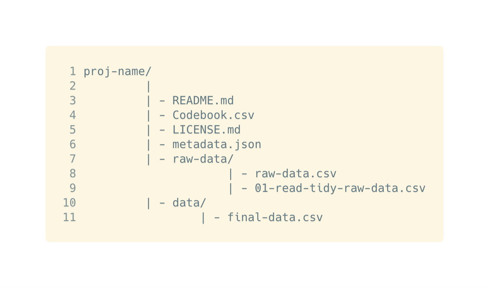

# The Dataset {#dataset}


**What is a legal dataset?**
```{r what-is-a-legal-dataset-video, echo=FALSE}
knitr::include_url("https://www.youtube.com/embed/7wrBtB_coJc?fs=1")
```


> Note: Content under this section is reproduced from a research paper titled -  [A Realistic Guide to Making Data Available Alongside Code to Improve Reproducibility](https://karthik.github.io/ddd) by [Nicholas J Tierney](http://www.njtierney.com/) & [Karthik Ram](https://ram.berkeley.edu/). 

To share data analysis data, there should be some minimal set of requirements. For example, the data should contain information on metadata, data dictionaries, the README, and data used in analysis. 

There are 8 pieces of content to consider for data sharing:

- README: A Human readable description of the data
- Data dictionary: Human readable dictionary of data contents
- License: How to use and share the data
- Citation: How you want your data to be cited
- Machine readable meta data: Make your data searchable
- Raw data: The original/first data provided
- Scripts: To clean raw data ready for analysis
- Analysis ready data: Final data used in analysis

To arrange the files, a tried and tested layout is shared below for your reference: 



Next, we'll discuss a few sections, mentioned above, in detail and also share a few reference links from other data repositories.  


## README {#readme}

A README is often the first place people will go to learn more about anything in a folder - they are very common in software, and historically were included so the uppercase letters of README meant it would be at the top of a directory. The README is meant for someone to read and understand more about the data and contains the `who, what, when, where, why, & how`:

  - **Who** collected it
  - **What** is the data
  - **When** was it collected
  - **Where** was it collected
  - **Why** it was collected
  - **How** is was collected

With one README per dataset, It should be brief, and provide links to the other aforementioned sections. It should also contain any other guidance for the user on how to read and interpret the whole dataset.

### README Examples {#readme-examples}

- [Vera Institute of Justice - Incarceration Trends Dataset](https://github.com/vera-institute/incarceration_trends/blob/master/README.md)

## Data Dictionary {#data-dictionary}

A data dictionary provide human readable description of the data, providing context on the nature and structure of the data. This helps someone not familiar with the data understand, and use the data. At a minimum they should contain the following pieces of information about the data:

- **variable names**
- **variable labels**
- **variable codes**, and
- special values for **missing data**.


An example data dictionary table from [incarceration trends repository](https://github.com/vera-institute/incarceration_trends/). This includes information on the variable, its class (type), and a longer description.

|Variable        |Class          |Description                                                     |
|:---------------|:--------------|:---------------------------------------------------------------|
|year            |integer (date) |Year                                                            |
|urbanicity      |character      |County-type (urban, suburban, small/mid, rural)                 |
|pop_category    |character      |Category for population - either race, gender, or Total         |
|rate_per_100000 |double         |Rate within a category for prison population per 100,000 people |

Note: __Every data dictionary should also be provided in its raw form (e.g., a CSV) in the repository__

### Data dictionary references {#data-dictionary-references}

- [The code book](https://github.com/jtleek/datasharing#the-code-book)
- [How to code variables](https://github.com/jtleek/datasharing#how-to-code-variables)
- [Data Dictionary: a how to and best practices](https://medium.com/@leapingllamas/data-dictionary-a-how-to-and-best-practices-a09a685dcd61)
- [Create a data dictionary](https://kbroman.org/dataorg/pages/dictionary.html)
- [How to Make a Data Dictionary](https://help.osf.io/hc/en-us/articles/360019739054-How-to-Make-a-Data-Dictionary)

## License {#license}

Data with a license clearly establishes rules on how everyone can modify, use, and share data. Without a license, these rules are unclear, and can lead to problems with attribution and citation. On the [Justice Hub](https://justicehub.in), you can share the dataset under one of these licences. 

|Title                                                                                       |URL                                               |
|--------------------------------------------------------------------------------------------|--------------------------------------------------|
|Creative Commons Attribution 4.0 International (CC BY 4.0)                                  |https://creativecommons.org/licenses/by/4.0/      |
|Creative Commons Attribution-ShareAlike 4.0 International (CC BY-SA 4.0)                    |https://creativecommons.org/licenses/by-sa/4.0/   |
|Creative Commons Attribution-NonCommercial 4.0 International (CC BY-NC 4.0)                 |https://creativecommons.org/licenses/by-nc/4.0/   |
|Creative Commons Attribution-NonCommercial-ShareAlike 4.0 International (CC BY-NC-SA 4.0)   |https://creativecommons.org/licenses/by-nc-sa/4.0/|
|Creative Commons Attribution-NoDerivatives 4.0 International (CC BY-ND 4.0)                 |https://creativecommons.org/licenses/by-nd/4.0/   |
|Creative Commons Attribution-NonCommercial-NoDerivatives 4.0 International (CC BY-NC-ND 4.0)|https://creativecommons.org/licenses/by-nc-nd/4.0/|
|CC0 1.0 Universal (CC0 1.0) Public Domain Dedication                                        |https://creativecommons.org/publicdomain/zero/1.0/|
|Open Data Commons Open Database License (ODbL)                                              |https://opendatacommons.org/licenses/odbl/        |
|Open Data Commons Attribution License (ODC-By)                                              |https://opendatacommons.org/licenses/by/          |
|Open Data Commons Public Domain Dedication and License (PDDL)                               |https://opendatacommons.org/licenses/pddl/        |

### Learn more about licensing {#license-references}

- The following [licenses](https://opendefinition.org/licenses/) are conformant with the principles set forth in the [Open Definition](https://opendefinition.org/). 
- A [guide](https://data.humdata.org/about/license) on Open Data Licensing by the [Humanatarian Data Exchange](https://data.humdata.org/)
- A short [guide](https://theodi.org/article/publishers-guide-to-open-data-licensing/) curated by the [Open Data Institute](https://theodi.org/) on Open Data Licensing
- [Difference Between Different Types Of Open Sources Licenses](https://fossbytes.com/open-sources-license-type/)

## Dataset Reproducibility {#dataset-reproducibility-links}

- [Organizing data in spreadsheets](https://www.tandfonline.com/doi/full/10.1080/00031305.2017.1375989)
- [A Realistic Guide to Making Data Available Alongside Code to Improve Reproducibility](https://karthik.github.io/ddd/)
- [Reproducibility in Science](https://ropensci.github.io/reproducibility-guide/)

## Data repositories {#data-repositories}

We're curating this list to learn about how legal data is being stored, managed and documented, around the world, by organisations, individuals and data platforms. 

- [Vera Institute - Incarceration Trends Dataset and Documentation ](https://github.com/vera-institute/incarceration_trends)
- [Datasets from the Human Rights Data Analysis group](https://hrdag.org/data-publication/)
    - [Colombia – Casanare (en español)](https://hrdag.org/casanare-colombia/)
    - [Guatemala – CIIDH datasets](https://hrdag.org/guatemala-ciidh-data/)
    - [Kosovo – Killings, Migrations, and More](https://hrdag.org/kosovo-data/)
    - [Liberia – Truth and Reconciliation Commission](https://hrdag.org/liberia-data/)
    - [Sierra Leone – TRC Data and Statistical Appendix](https://hrdag.org/sierra-leone-data/)
- [The CIRI Human Rights Dataset](http://www.humanrightsdata.com/p/data-documentation.html)

Do [write to us](mailto:info@justicehub.in) if you come across well documented legal datasets that we can all learn from. We'll be happy and proud to include more resources and content from the legal data community in India. 

